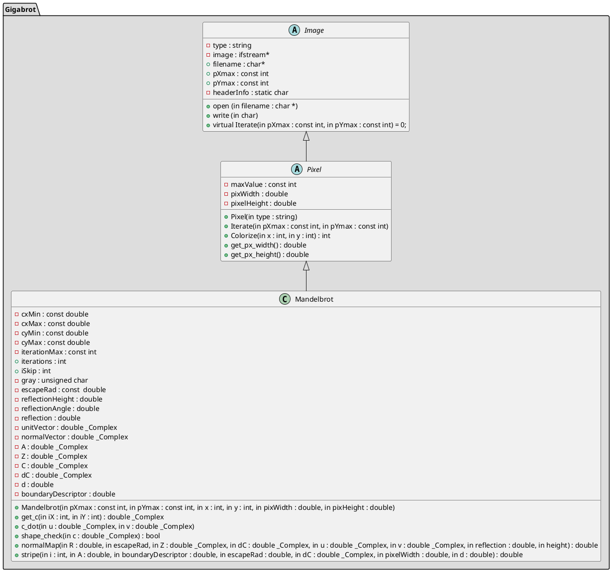

### Chris Biancone
### 11-23-2021
### EEEE-346
## Final Project Proposal
 
 

# Overview
The concept of this project is to continue working on code that I had begun last year as a way to practice my programming skills and incorporate some various concepts along the way. The original project is written in C, and I aim to use this C++ implementation as a stepping stone to eventually running it in CUDA or OpenCL.

The code will, based on some user input parameters, calculate the Mandelbrot set and generate an image file with specific colorization that I have already defined. Calculating the Mandelbrot set involves a simple algorithm, and the striping I have defined performs math on top of this to highlight the Fibonacci sequence within the set numbers. I also use a vector map with the calculated numbers to perform a neumorphic-like shading on the output that makes the image pop. While this code has been implemented in C and currently uses OpenMP for parallel computing, it is going to take a lot of restructuring and reworking to use a class hierarchy in C++. My main goal is to implement this for serial computing, and if that works well, potentially write my own class to handle threading. Hopefully that will bring the project closer to being able to perform a gigapixel render in a reasonable time. I want to better organize the class structure to allow for a separate colorization class to handle different types of colorization and make it more readable.
 
 

# UML

 
 
# Concepts

* Class inheritance exhibited by working inward from image to pixel to the Mandelbrot numbers
* Polymorphism shown through functions like iterate() that are declared at image level and implemented at pixel level; class hierarchy has abstract classes
* Will implement operator overloading for copy constructor, assignment operator for pixel and increment operator for pixel
* Using linked list to handle image data for one row at a time
* Try/catch to be implemented in shape checking function
* Error handling for user inputs
* Inherently implements file processing and Standard Template Libraries